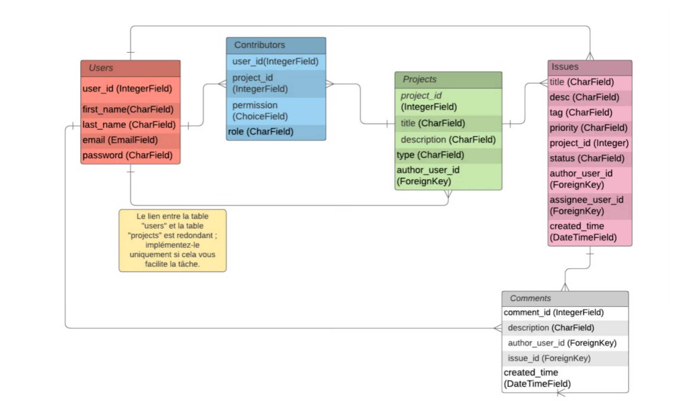
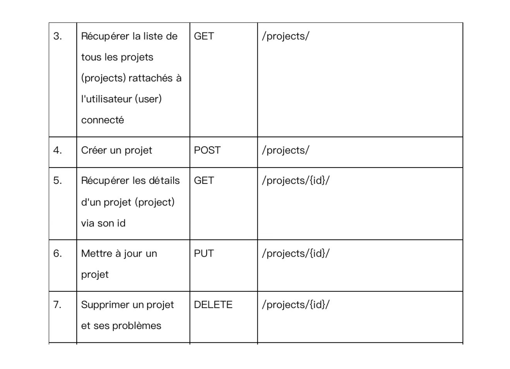
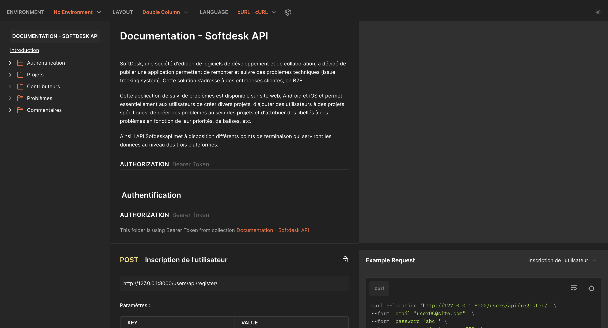

## Projet : Créez une API sécurisée RESTful en utilisant Django REST

[**English**](README.md)
<p>
  
  
  
</p>

### Tables des matières :
1. Description générale du projet/Scénario.
2. Configurations compatibles.
3. Installation du programme.
4. Fonctionnalités.
5. Authentification et permissions
6. Démarrage du programme.

## 1. Descripton générale du projet/Scénario :

Ce projet a été réalisé dans le cadre de la formation de
développeur Python proposée par OpenClassrooms. 

SoftDesk, une société d'édition de logiciels de développement et de collaboration, a décidé de publier une application
permettant de remonter et suivre des problèmes techniques (issue tracking system). Cette solution s’adresse à des
entreprises clientes, en B2B.

Cette application de suivi de problèmes est disponible sur site web, Android et iOS et permet essentiellement 
aux utilisateurs de créer divers projets, d'ajouter des utilisateurs à des projets spécifiques, de créer des problèmes
au sein des projets et d'attribuer des libellés à ces problèmes en fonction de leur priorités, de balises, etc.

Ainsi, l'API Sofdeskapi met à disposition différents points de terminaison qui serviront les données au niveau
des trois plateformes.


## 2. Configurations compatibles :

* Python 3
* Windows 10
* MacOS
* Linux

## 3. Installation du programme :
Ce programme utilise les librairies Python suivantes :

```
asgiref 3.6.0
Django 4.2
djangorestframewor 3.14.0
djangorestframework-simplejwt 4.7.2
PyJWT 2.6.0
pytz 2023.3
sqlparse 0.4.3

```

## 4. Fonctionnalités :

### Accès aux différentes données via les  points de terminaison qui sont répartis en cinq catégories : 

  * Inscription/Connexion
  * Projets
  * Problèmes
  * Commentaires
  * Contributeurs

  Pour une explication détaillée de l'API et de ses "endpoints",
  consulter la [**documentation**](https://documenter.getpostman.com/view/25420128/2s93ecwqUU).

## 5. Authentification et permissions :
    
  * L'**authentification** pour le back-end est assurée par **JWT** (JSON Web Token)
  * Pour la partie **autorisation** et **accès**, plusieurs **permissions** ont été mises en place selon le statut de
l'utilisateur effectuant la requête :
    * Tout utilisateur doit être authentifié pour accéder aux données.
    * **Projet** :
      * La **lecture** et la **création** sont autorisées à tout utilisateur authentifié.
      * la **modification** et la **suppression** ne sont autorisées qu'à l'auteur du projet.
    * **Problème** :
      * La **lecture** et la **création** ne sont autorisées qu'aux contributeurs du projet auquel est rattaché ce problème.
      * la **modification** et la **suppression** ne sont autorisées qu'à l'auteur du projet et du problème.
    * **Commentaire** :
      * La **lecture** et la **création** ne sont autorisées qu'aux contributeurs du projet.
      * la **modification** et la **suppression** ne sont autorisées qu'à l'auteur du projet et du commentaire.

## 6. Démarrage du programme :

1. Ouvrir un terminal (ex: Cygwin pour Windows, le terminal pour MacOS) ou dans un IDE (ex: PyCharm).
2. Cloner le repository dans un répertoire local :
  > $<b> git clone repository path</b> 
3. Se placer dans ce dossier sur le terminal.
4. Créer un environnement virtuel avec :
  > $<b> python -m venv <nom de l'environnement></b> 
5. Activer l'environnement virtuel en éxécutant :
  > $ <b>source env/bin/activate</b>  (sur MacOS et Linux) 

  > $ <b>env\Scripts\activate.bat</b> (sur Windows)
6. Installer les paquets présents dans le fichier requirements.txt (ce fichier se trouve dans le dossier du projet) avec :
  > $ <b>pip install -r requirements.txt</b> 
7. Finalement, exécuter le serveur de développement avec :
> $ <b>python manage.py runserver</b>
8. Consulter le site à l'adresse suivante et accéder aux différents endpoints :

      **http://127.0.0.1:8000/**
---